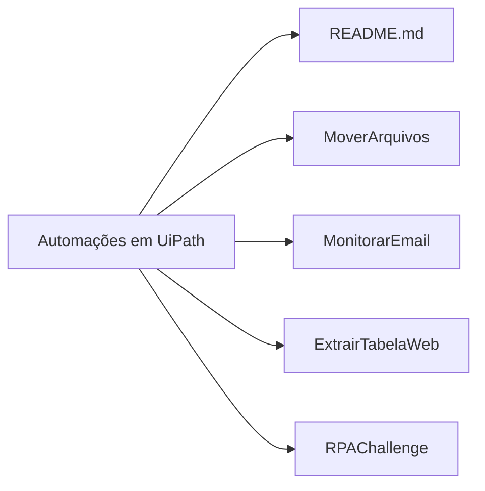

# Automações em UiPath

Esse repositório de tipo monolítico colecionará projetos de **Automações em UiPath**.

## Objetivo

1. **Criar** um repositório central para **versionar** diferentes projetos que tem em comum:
- **Automação de processos;**
- **Plataforma Uipath**

2. **Demonstrar** habilidades de criação de soluções em **RPA**.

## Estrutura do Repositório

