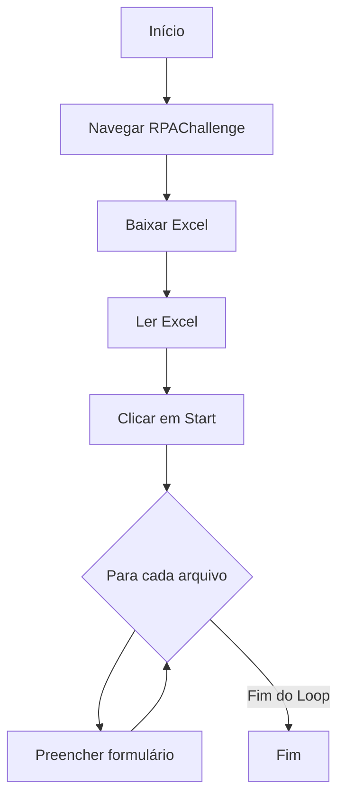
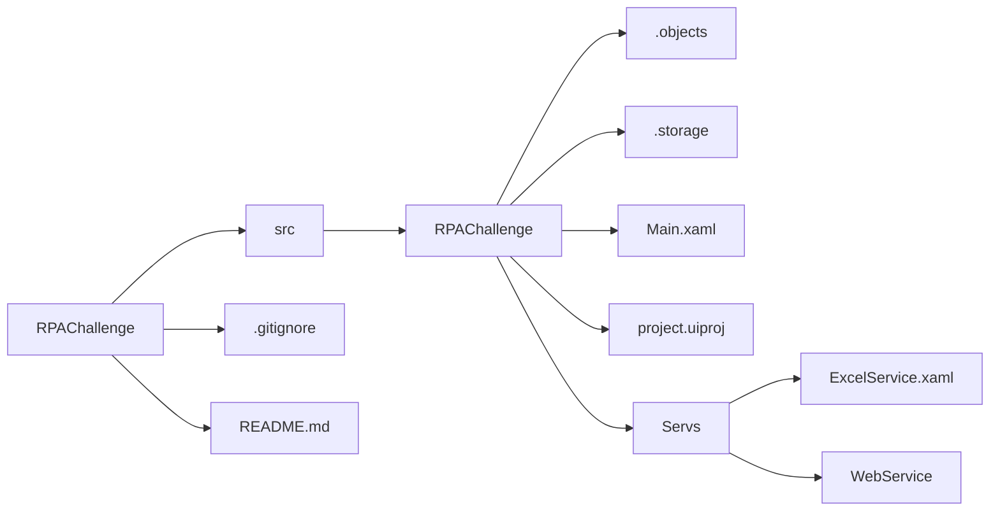

# RPA Challenge

Desafio clássico de RPA que envolve conseguir navegar e controlar uma página web mesmo que com dificuldade em seletores confiáveis para os campos de interação. 
Além de testa as habilidades de leitura de arquivo do Excel linha por linha, download e gravação de arquivos.
 
## Passos do desafio

1. **Navegar** para site;
2. **Clicar** no botão "Download Excel" e **fazer** o download do arquivo .xlsx;
3. **Ler** a planilha;
4. **Clicar** no botão Start;
5. **Preencher** o formulário com os dados;
6. **Clicar** em submeter;

## Como funciona

A automação funciona no modo headless.
 
## Tecnologias utilizadas

- **UiPath**;
- **.NET**;

## Benefícios da Automação

- **Evitar** trabalho repetitivo de realizar inscrições em formulários;
- **Reduzir** erros humanos no preenchimento de dados;
- **Melhorar** qualidade de cadastros;
- **Padronizar** o fluxo de trabalho em formulários;
- **Possibilitar** a auditoria do processo por meio de prints. 

##  Diagrama de funcionamento

## Arquitetura de Pasta

