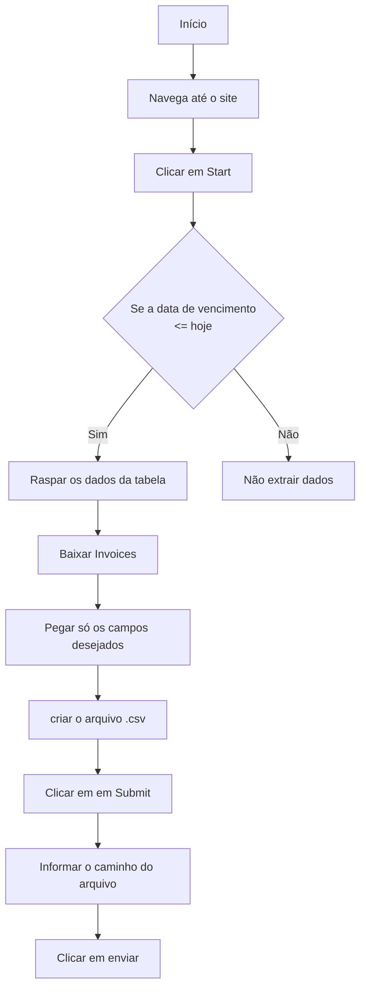
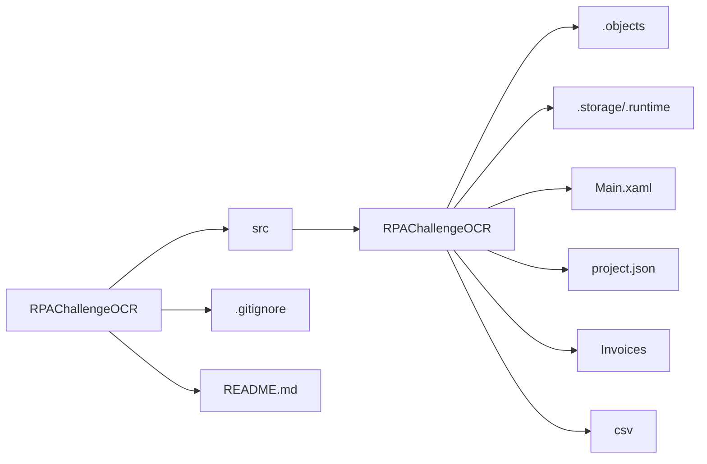

# RPA Challenge OCR

Essa automação tem por objetivo resolver o problema proposto pelo [RPA Challenge OCR](https://rpachallengeocr.azurewebsites.net/).

## Entendendo o desafio

O desafio consiste em conseguir extrair dados de uma tabela, e de notas fiscais em formato .pdf.
De posse dessas informações formatar como um arquivo .cvs e enviar para o site.

## Objetivos da Automação

1.  **Abrir** o site [RPA Challenge OCR](https://rpachallengeocr.azurewebsites.net/);
2.  **Clicar** no botão iniciar;
3.  **Raspar** os dados de uma tabela paginada;
4.  **Filtrar** os dados de acordo com a data de vencimento (passada ou de hoje);
5.  **Baixar** cada invoice seguindo o critério;
5.  **Pegar** apenas os campos "ID" e "Due Date" na tabela;
6.  **Concatenar** com os campos Invoice Date, Company Name ae Total Due de cada Invoice;
7.  **Criar** um arquivo .csv com os campos nessa ordem: ID, DueDate, InvoiceNo, InvoiceDate, CompanyName, TotalDue;
8.  **Clicar** em submeter;
9.  **Preencher** na tela de envio o caminho de onde o .csv foi criado e clicar em enviar;
10.  **Observar** a tela de resultado.

## Benefícios da automação

-   **Evitar**  trabalho repetitivo de coleta e manipulação de dados;
-   **Reduzir**  erros humanos no manejo de informações;
-   **Melhorar**  o tempo e a qualidade do processamento de arquivos;
-   **Padronizar**  o fluxo de processamento de dados;
-   **Garantir** que dados sejam extraídos corretamente por OCR;
-   **Possibilitar**  a auditoria do processo.

## Tecnologias utilizadas

-   **UiPath**;
-   **.NET**;
-   **OCR**;
-   **Automação RPA.**

## Diagrama da automação

## Arquitetura de pastas

